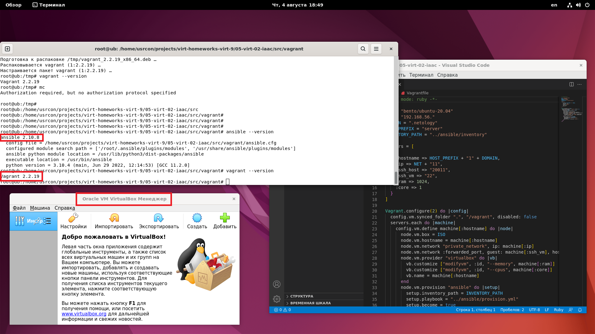

# 05-virt-02-iaac


## Задача 1
**Опишите своими словами основные преимущества применения на практике IaaC паттернов.**

 Ускорение самого процесса разработки. То есть, с момента зарождения идеи функционала до поставления его на прод. Поскольку ускоряется сама настройка и повторяемость среды для разработки, тестирования и выкатывания проекта. Если мы описали нашу инфраструктуру в виде файлов, и держим ее в одном месте в качестве источника правды, то риски ошибиться при проведении тестирования или уже при развертывании минимальны. Также IaaC ускоряет маштабирование нашей среды, а также ее миграцию, поскольку все, что нам нужно поправить наши файлы без необходимости "лезть" на физические сервера вводя их в работу и ставя необходимое дляя этого окружение. Более того вся история изменений храниться в одном месте (нам не нужно в случае чего "лезть" на каждый сервер и судорожно вводить history

**Какой из принципов IaaC является основополагающим?**

Самый основной принцип IaaC состоит в том, что помимо кода приложения всю среду со всеми зависимостями мы также храним и описываем декларативно в виде кода. Когда нам необходимо поднять наше приложение мы его не устанавливаем на сервер и молимся, чтобы оно заработало, а делаем так, чтобы приложение стартовало со всей средой (контейнерами, бд, зависимостями) и т.д. согласно файлам, которыми мы описали нашу инфраструктуру.

## Задача 2
**Чем Ansible выгодно отличается от других систем управление конфигурациями?**
- Низкий порог входа, если сравнивать с теми же шефом или папетом
- Отсутствуют агенты => не нужно предварительно их устанавливать на управляемый хост
- Много управляющих модулей, которые очень подробно и с примерами описаны в доке по ansible
- При необходимости быстрая расширяемость

**Какой, на ваш взгляд, метод работы систем конфигурации более надёжный push или pull?**

У каждой системы есть свои плюсы и минусы. Здесь нет такой вещи, как более надежный метод или менее надежный. Нужно действовать исходя из конкретной задачи (количество оборудования, тип оборудования).

## Задача 3

Установить на личный компьютер:

- VirtualBox:
```
root@tester:~# virtualbox --help
Oracle VM VirtualBox VM Selector v6.1.34_Ubuntu
(C) 2005-2022 Oracle Corporation
All rights reserved.

No special options.

If you are looking for --startvm and related options, you need to use VirtualBoxVM.
```

- Vagrant
```
root@tester:~# vagrant --version
Vagrant 2.2.19
```
- Ansible
```
root@tester:~# ansible --version
ansible 2.10.8
  config file = None
  configured module search path = ['/root/.ansible/plugins/modules', '/usr/share/ansible/plugins/modules']
  ansible python module location = /usr/lib/python3/dist-packages/ansible
  executable location = /usr/bin/ansible
  python version = 3.10.4 (main, Jun 29 2022, 12:14:53) [GCC 11.2.0]
```
*Приложить вывод команд установленных версий каждой из программ, оформленный в markdown.*



